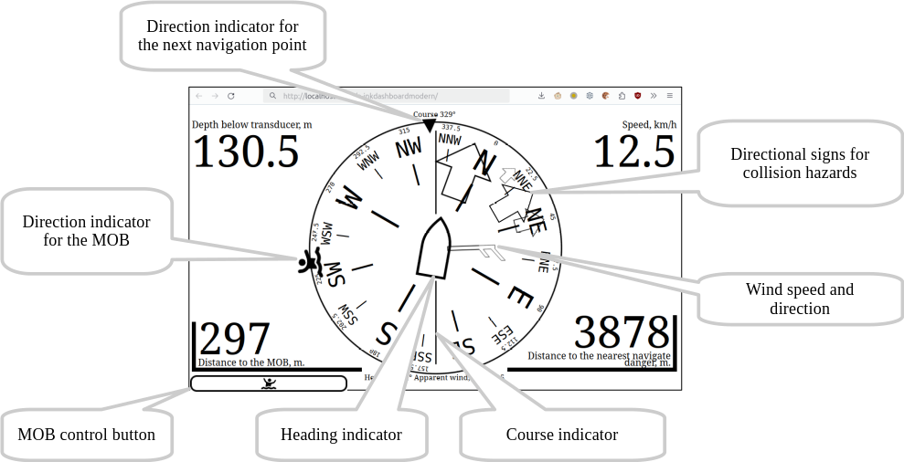
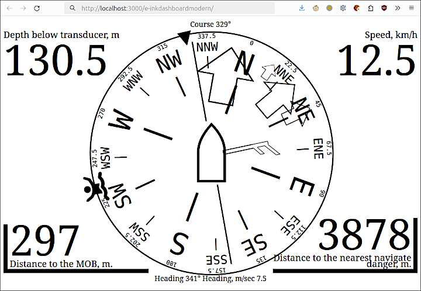
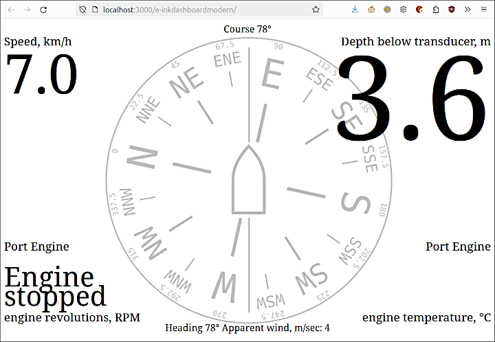
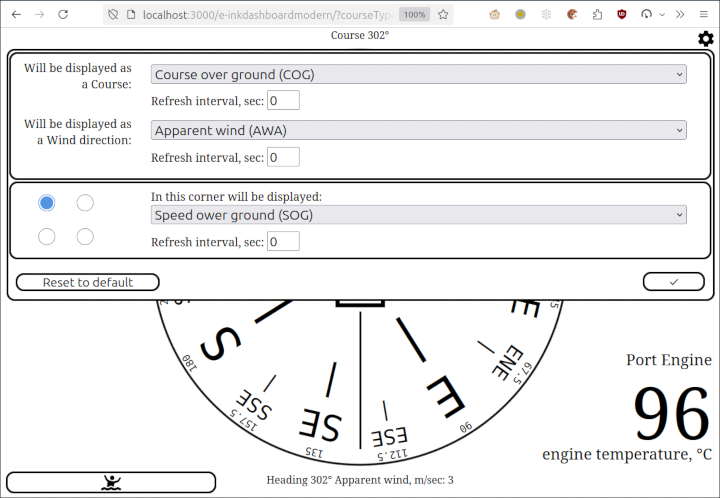

[По русски](README.ru-RU.md)  
# E-InkDashboardModern 
A web-based application that shows the main parameters of a vessel's movement, obtained from a server backend.  
The application is aimed at mobile devices with an e-ink screen and does not require the installation of any additional applications: the existing browser is sufficient.  
Of course, the app also works in any more or less modern browser on any device with any screen size.

The data source for the E-InkDashboardModern can be [gpsd2websocket](https://github.com/VladimirKalachikhin/gpsd2websocket) or [gpsdPROXY](https://github.com/VladimirKalachikhin/gpsdPROXY).

**WARNING! No information shown or not shown by this application may serve as a basis for an action or inaction of the shipmaster.**

## v. 0
Contents:  
- [Features](#features)
- - [Direction](#direction)
- - [Wind](#wind)
- - [Collision alarm](#collision-alarm)
- - [Man Overboard](#man-overboard)
- - [In screen corners](#in-screen-corners)
- - [Client settings and kiosk mode](#client-settings-and-kiosk-mode)
- [Requirements](#requirements)
- [Installation](#installation)
- [Configuration](#configuration)
- [Launch](#launch)
- [Support](#support)

## Features
If data are available, the following directions and values may be shown:

  
### Direction
One of the following values can be selected as the direction in the application configuration:

* Course over ground
* Course over ground magnetic
* Heading true
* Heading magnetic

The Course over ground is default value because this is commonly reported by the GPS receiver.

If Course is selected as the direction, the course indicator remains vertical and, when heading information is available, the schematic representation of the ship in the centre is rotated by the drift angle to indicate the heading. If Heading is selected as the direction, the heading indicator remains vertical and the course indicator is rotated by the drift angle, as shown in the illustration below.  
If there is only one of the values: course or heading, the direction of the both indicators remains vertical.  
Which value is selected as the direction is indicated below the top edge of the screen, and which value will be rotated is indicated above the bottom edge.

### Wind
If wind speed and wind direction information is available, a wind indicator will be displayed. The symbols of the pointer corresponds to that used in meteorology: a short stroke means a wind speed of 2.5 m/sec, a long stroke means 5 m/sec, and a triangle means 25 m/sec. Thus, the illustration shows wind speeds greater than or equal to 7.5 but less than 10 m/sec.  
For your reference, the exact wind speed is indicated above the bottom edge of the screen.

One of the following values may be specified as the wind:

* Apparent wind
* Wind direction true
* Wind direction magnetic
* none

The default value is the Apparent wind.

### Collision alarm
Using this feature requires [gpsdPROXY](https://github.com/VladimirKalachikhin/gpsdPROXY) as backend.

Pointers in the form of contour arrows indicate directions to hazards issued by the collision-detector extension. The largest arrow shows the direction of the nearest hazard, with the distance to the hazard displayed in the lower right corner of the screen (regardless of what was previously shown there). This value is framed by a flashing corner frame to attract attention.  
Once the hazard is gone, the information in the lower right corner is restored.

### Man Overboard
Using this feature requires [gpsdPROXY](https://github.com/VladimirKalachikhin/gpsdPROXY) as backend.

The "Man Overboard" mode raise by  pressing the key  A message is sent to the gpsdPROXY server, which can be picked up by relevant programmes. So the [GaladrielMap](https://github.com/VladimirKalachikhin/Galadriel-map) chartplotter displays the location of the object.  
The direction to the object is shown, and the distance is also shown in the lower left corner, regardless of what has been shown at that location before. The distance is framed by a flashing corner frame to attract attention.  
The information in the lower left corner is restored when the "Man Overboard" situation is canceled.

You can cancel the "Man overboard" mode by pressing the key in the lower left corner again. In the panel that opens, select Cancel. You can also cancel the "Man overboard" mode by using the corresponding tools in the [GaladrielMap](https://github.com/VladimirKalachikhin/Galadriel-map) chartploter.  
If necessary, using the same panel, you can add more points related to the "Man overboard" situation. They will be shown in the chartplotter [GaladrielMap](https://github.com/VladimirKalachikhin/Galadriel-map) and can be processed there.

### In screen corners
One of the following values may be displayed in each of the four corners of the screen, if the backend server has the information:

* Speed ower ground
* Depth (below surface, below keel or below transducer depending on backend settings)
* Air temperature
* Water temperature
* none

Default values:

- the left top corner: Speed ower ground
- the right top corner: Depth
- the left bottom corner: none
- the right bottom corner: none

What exactly to show in each corner is determined in the configuration file for all clients and by a menu in the top right corner - individually for each client.

A tap in the corner of the screen enlarges the display of the corresponding value. This can be useful for temporarily improving the readability of specific data in special situations.  
  
Tapping again returns the displaying to its normal size.

### Client settings and kiosk mode
In the `options.js` configuration file you can set which values will be displayed on the dashboard. However, these parameters can be specified individually for each client by tap in the upper right corner:  
  
These settings are stored in the client.  
#### Kiosk mode
If your client device does not have any controls, including a touchscreen, you can specify "kioskMode" option in the configuration file. The controls will not be displayed on the screen, and the displayed values can only be changed in the configuration file.

## Requirements
The web application requires a more or less modern browser (version not older than 5 years), and will not work in Internet Explorer browser. Some device performance and sufficient e-ink screen refresh rate are also required. However, all modern e-book type devices have the required features.

## Installation
Just copy the application directory content to any directory accessible by the web server. Or place the catalog with the application on the target user device: the E-InkDashboardModern does not require a web server to run.

## Configuration
The configuration file is `options.js`. No any options are required.

## Launch
In addition to the usual launch by specifying the url in the browser, you can also launch the E-InkDashboardModern just by opening the `index.html` file by browser. So, the presence of a web server is not mandatory. You can place the application directly on the client device.

## Support
[Discussions](https://github.com/VladimirKalachikhin/Galadriel-map/discussions)

The forum will be more lively if you make a donation at [ЮMoney](https://sobe.ru/na/galadrielmap)

[Paid personal consulting](https://kwork.ru/it-support/20093939/galadrielmap-installation-configuration-and-usage-consulting)  

If you think the app should support nautical units of measurement - make a donation marked "For Nautical Units". If enough money is raised, the author will make an endorsement.  
If you really need marine units of measurement - make a substantial donation and the author will make a support specifically for you.

