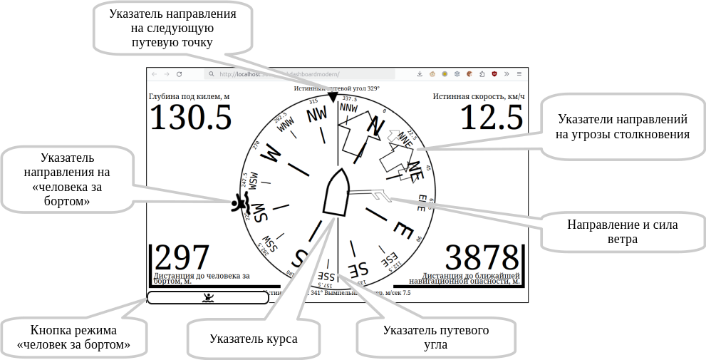
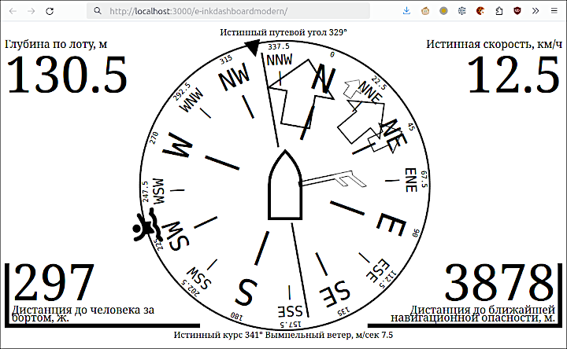
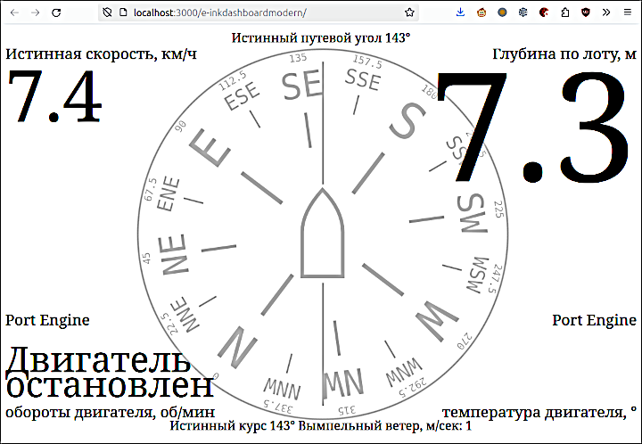
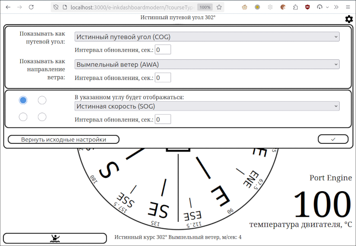

[In English](README.md)  
# E-InkDashboardModern 
Веб-приложение, показывающее в браузере основные параметры движения судна, получаемые от соответствующего источника данных.  
Приложение ориентировано на мобильные устройства с e-ink экраном (на "электронных чернилах") и не требует установки на устройство каких-либо приложений: достаточно имеющегося браузера.  
Разумеется, приложение работает также в любом более-менее современном браузере на любом устройстве с любым размером экрана.

Источником данных для E-InkDashboardModern может быть [gpsd2websocket](https://github.com/VladimirKalachikhin/gpsd2websocket) или [gpsdPROXY](https://github.com/VladimirKalachikhin/gpsdPROXY).

**Внимание! Никакая информация, показываемая или не показываемая этим приложением, не может служить основанием для действия или бездействия судоводителя.**   

## v. 0
Оглавление:  
- [Возможности](#возможности)
- - [Направление движения](#направление-движения)
- - [Ветер](#ветер)
- - [Угроза столкновения](#угроза-столкновения)
- - ["Человек за бортом"](#человек-за-бортом)
- - [В углах экрана](#в-углах-экрана)
- - [Индивидуальная настройка и устройства без органов управления](#индивидуальная-настройка-и-устройства-без-органов-управления)
- [Требования](#требования)
- [Установка](#установка)
- [Конфигурирование](#конфигурирование)
- [Запуск](#запуск)
- [Поддержка](#поддержка)

## Возможности
При наличии данных могут быть показаны следующие направления и величины:  

  
### Направление движения
За направление в конфигурации приложения может быть выбрана одна из следующих величин:  

* Истинный путевой угол (COG)
* Магнитный путевой угол (CGM)
* Истинный курс (HT)
* Магнитный курс (HC)

По умолчанию выбирается истинный путевой угол, потому что именно эту величину сообщает приёмник ГПС.

Если в качестве направления выбирается путевой угол, то указатель направления движения остаётся вертикальным, а при наличии информации о курсе схематическое изображение кораблика в центре поворачивается на угол дрейфа и указывает курс. Если же в качестве направления выбирается курс, то указатель курса остаётся вертикальным, а на угол дрейфа поворачивается указатель путевого угла, как это показано на иллюстрации ниже.  
Если есть только одна из величин: путевой угол или курс, то направление указателей остаётся вертикальным.  
Какая величина выбрана в качестве направления указывается под верхним обрезом экрана, а какая будет поворачиваться - над нижним.

### Ветер
При наличии информации о скорости и направлении ветра будет показываться указатель ветра. Символика указателя соответствует принятой в метеорологии: короткий штрих означает скорость ветра 2.5 м/сек, длинный - 5 м/сек, а треугольник - 25 м/сек.  
Таким образом, на иллюстрации указана скорость ветра больше или равно 7.5, но меньше 10 м/сек.  
Для справки точная скорость ветра указывается над нижним обрезом экрана.  

В качестве ветра может быть указана одна из следующих величин:

* Вымпельный ветер (AWA)
* Истинный ветер (TWD)
* Магнитный истинный ветер (MWD)
* none - не показывать ветер

Умолчальным значением является вымпельный ветер.

### Угроза столкновения
Использование этой возможности требует [gpsdPROXY](https://github.com/VladimirKalachikhin/gpsdPROXY) как источника данных.  

Указатели в виде контурных стрелок указывают направления на опасности, выдаваемые расширением collision-detector. Самая крупная стрелка показывает направление ближайшей опасности, при этом расстояние до опасности отображается в правом нижнем углу экрана (вне зависимости от того, что там показывалось ранее). Для привлечения внимания эта величина обрамляется мигающей угловой рамкой.  
После исчезновения опасности информация в правом нижнем углу восстанавливается.

### "Человек за бортом"
Использование этой возможности требует [gpsdPROXY](https://github.com/VladimirKalachikhin/gpsdPROXY) как источника данных.  

Активация режима "Человек за бортом" осуществляется нажатием на клавишу  в левом нижнем углу. На сервер gpsdPROXY посылается сообщение, которое может быть воспринято соответствующими программами, а картплотер [GaladrielMap](https://github.com/VladimirKalachikhin/Galadriel-map) покажет местонахождение объекта.  
Приложение показывает направление на объект, кроме того, в левом нижнем углу указывается дистанция, вне зависимости от того, что показывалось на этом месте ранее. Для привлечения внимания дистанция обрамляется мигающей угловой рамкой.  
После прекращения ситуации "Человек за бортом" информация в левом нижнем углу восстанавливается.

Прекратить режим "Человек за бортом" можно повторным нажатием клавиши в левом нижнем углу. На открывшейся панели надо выбрать "Завершить". Также прекратить режим "Человек за бортом" можно соответствующими средствами в картплотере [GaladrielMap](https://github.com/VladimirKalachikhin/Galadriel-map).  
При необходимости с помощью той же панели можно добавить ещё точки, имеющие отношение к ситуации "Человек за бортом". Они будут показаны в картплотере [GaladrielMap](https://github.com/VladimirKalachikhin/Galadriel-map) и могут быть там обработаны.

### В углах экрана
В каждом из четырёх углов экрана может быть отображена одна из следующих величин, если соответствующая информация есть у источника данных:

* Истинная скорость (SOG)
* Глубина (от поверхности, под килем или по лоту - в зависимости от настроек источника данных)
* Температура воздуха
* Температура воды
* ничего не показывать

Умолчальными значениями являются:  

- для левого верхнего угла: истинная скорость  
- для правого верхнего угла: глубина  
- для левого нижнего угла: температура воды  
- для правого нижнего угла: температура воздуха  

Что именно показывать в каждом углу определяется в настройках приложения или индивидуально для каждого клиента с помощью меню в правом верхнем углу.  

Краткое касание в углу экрана укрупняет отображение соответствующей величины. Это может быть полезно для временного улучшения читаемости конкретных данных в особых ситуациях.  
  
Повторное касание возвращает обычный размер изображения.

### Индивидуальная настройка и устройства без органов управления
Настройки приложения находятся в файле `options.js`, и там могут быть устанавлены величины, которые будут одинаково показываться во всех экземплярах приложения. Однако, на каждом устройстве с приложением можно сконфигурировать свой собственный набор показываемых величин:  
  
Меню настроек находится в правом верхнем углу. Настройки сохраняются на устройстве.

#### Устройства без органов управления
Если требуется показывать приложение на устройстве, не имеющем органов управления, в том числе и сенсорного экрана, можно указать параметр "kioskMode" в настройках приложения. Тогда меню и кнопки исчезнут с экрана, а показываемые величины можно будет изменять только в настройках приложения.

## Требования
Веб-приложение требует более-менее современного браузера (версии не старше 5 лет), и заведомо не работает в браузере Internet Explorer. Требуется также некоторая производительность устройства и достаточная скорость обновления e-ink экрана. Впрочем, все современные устройства типа "электронная книга" обладают требуемыми характеристиками.

## Установка
Просто скопируйте содержимое каталога E-InkDashboardModern в любой каталог, доступный веб-серверу. Однако, E-InkDashboardModern не нуждается в веб-сервере для своего запуска, поэтому каталог с приложением можно разместить непосредственно на пользовательском устройстве.

## Конфигурирование
Все настройки приложения находятся в файле `options.js`. Никакая настройка не является обязательной.

## Запуск
При наличии веб-сервера запуск приложения осуществляется обычным образом - указанием сетевого адреса в адресной строке браузера. Кроме того, можно запустить E-InkDashboardModern без участия веб-сервера, просто тем или иным способом открыв файл `index.html` в браузере. Т.е., каталог с приложением может находиться на пользовательском устройстве, а не на сервере.

## Поддержка
[Форум](https://github.com/VladimirKalachikhin/Galadriel-map/discussions)

Форум будет живее, если вы сделаете пожертвование на [ЮМани](https://sobe.ru/na/galadrielmap).

Вы можете получить [индивидуальную платную консультацию](https://kwork.ru/training-consulting/20093293/konsultatsii-po-ustanovke-i-ispolzovaniyu-galadrielmap) по вопросам установки и использования E-InkDashboardModern.

Если Вы считаете, что приложение должно поддерживать морские единицы измерения - внесите пожертвование с пометкой "За морские единицы". Если наберётся достаточная сумма - автор сделает поддержку.  
Если Вам очень нужны морские единицы измерения - внесите весомое пожертвование, и автор сделает поддержку специально для Вас.
